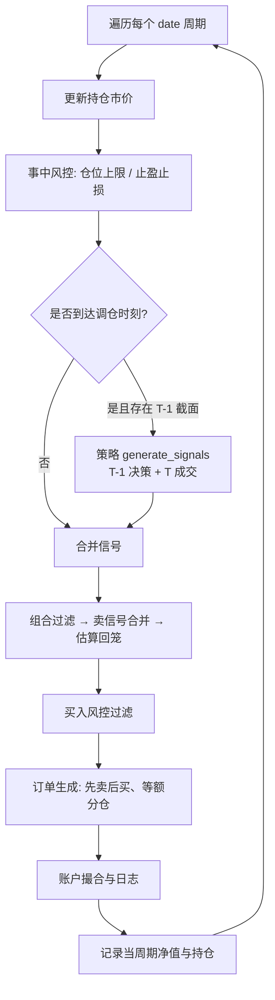

# 可转债回测系统（yunshan_backtest_system）

面向可转债等标的的**事件驱动、严格时序**量化回测框架。系统按行情周期（分钟 / 日等，由数据 `date` 列粒度决定）推进主循环，集成策略信号、组合过滤、风控、订单生成与账户撮合，并输出净值、成交、信号、持仓及绩效分析结果。

默认内置 **低价轮动策略**：每个调仓周期持有收盘价最低的 N 只标的，并与中证转债指数等基准对比。

---

## 功能概览

| 模块 | 说明 |
|------|------|
| **回测引擎** | 按 `date` 分组遍历行情；T-1 截面决策、T 截面成交；支持按时间或按 K 线根数调仓 |
| **策略层** | 可插拔策略（继承 `BaseStrategy`，实现 `generate_signals`） |
| **组合管理** | 黑名单过滤、等额分仓仓位计算 |
| **风控** | 单票仓位上限、止盈止损、买入现金与仓位校验 |
| **账户** | 现金 / 持仓 / 手续费；最小交易单位（默认 10 张） |
| **绩效** | 总收益、年化、最大回撤、夏普 / 索提诺；日频净值分析与基准对比 |
| **可视化** | 净值曲线图（PNG，带时间戳防覆盖） |

---

## 项目结构

```
backtest_system_update/
├── config/
│   └── settings.py              # 全局参数与路径（唯一配置入口）
├── data/
│   ├── data_processor.py        # 行情 / 基准加载与清洗
│   ├── market_data/             # 行情 CSV（需自行放置）
│   └── benchmark/               # 基准净值 CSV
├── strategy/
│   ├── strategy_base.py         # 策略抽象基类
│   └── strategy_low_price.py    # 低价轮动示例策略
├── backtest_engine/
│   ├── backtest_engine.py       # 回测主引擎（调度中心）
│   ├── core/                    # 实体与枚举（信号、订单、方向等）
│   ├── module/                  # 账户、组合、订单生成
│   └── log/                     # 日志与绩效指标
├── risk_manager/
│   └── risk_manager.py          # 风控逻辑
├── analyse/
│   └── plotter.py               # 净值曲线绘图
├── tools/                       # 工具函数（计算、路径、执行口径等）
├── run/
│   └── main.py                  # 回测入口脚本
└── results/                     # 回测输出（运行时生成）
    ├── equity/                  # 净值曲线、分析表、图片
    ├── trades/                  # 成交明细
    ├── signals/                 # 信号明细
    └── positions/               # 持仓快照
```

---

## 环境要求

- **Python**：3.10+（推荐 3.11）
- **依赖**：

```bash
pip install pandas numpy tqdm matplotlib
```

| 包 | 用途 |
|----|------|
| `pandas` / `numpy` | 数据处理与指标计算 |
| `tqdm` | 回测主循环进度条 |
| `matplotlib` | 净值曲线可视化（需系统有中文字体，如 SimHei） |

---

## 快速开始

### 1. 准备数据

**行情数据**（默认路径见 `config/settings.py` 中的 `DATA_CSV_PATH`）：

- 放置于 `data/market_data/data0518.csv`（文件名可在配置中修改）
- 至少包含列：`date`、`symbol`、`close`
- 若原始列为 `StockID`，加载时会自动重命名为 `symbol`
- 可选列：`StockName`（用于成交 / 信号日志中的名称展示）

**基准数据**（默认 `data/benchmark/csi_convertible_bond.csv`）：

- 至少包含：`date`、一列净值（推荐列名 `benchmark_nav`）
- 亦支持列名含「转债」「中证」等，或在 `settings.py` 中指定 `BENCHMARK_NAV_COLUMN`

### 2. 修改配置

编辑 `config/settings.py`，重点项：

- `START_DATE` / `END_DATE`：回测区间
- `INITIAL_CAPITAL`：初始资金
- `TOP_N`：策略持仓数量
- `REBALANCE_MODE` / `REBALANCE_INTERVAL` / `REBALANCE_BARS`：调仓方式
- `DATA_CSV_PATH`、`BENCHMARK_CSV_PATH`：数据路径

### 3. 运行回测

在项目根目录执行（确保 Python 能 import 到项目包）：

```bash
# 方式一：以模块方式运行（推荐）
cd /path/to/backtest_system_update
python -m run.main

# 方式二：直接运行脚本前，将项目根目录加入 PYTHONPATH
# Windows PowerShell:
$env:PYTHONPATH = "E:\云杉树实习\backtest_system_update"
python run/main.py
```

> **注意**：`run/main.py` 内若仍写有硬编码的 `ROOT_PATH`（如指向旧目录 `backtest_system`），请改为当前项目根目录，或删除该段并改用上述 `PYTHONPATH` / `python -m` 方式，避免 import 失败。

### 4. 查看输出

每次运行会生成统一时间戳 `run_stamp`（格式 `YYYYMMDD_HHMMSS`），例如：

| 文件 | 路径示例 |
|------|----------|
| 净值序列 | `results/equity/equity_curve_{run_stamp}.csv` |
| 成交明细 | `results/trades/trades_{run_stamp}.csv` |
| 信号明细 | `results/signals/signals_{run_stamp}.csv` |
| 持仓快照 | `results/positions/positions_{run_stamp}.csv` |
| 日频净值分析 | `results/equity/nav_analysis_{run_stamp}.csv` |
| 净值曲线图 | `results/equity/low_price_equity_{run_stamp}.png` |

控制台 / 运行日志会打印核心绩效（总收益、年化、最大回撤、夏普等）及相对基准的净值分析指标。

---

## 回测流程说明

主循环由 `BacktestEngine.run()` 驱动，每个行情周期（`date` 唯一值为一根 bar）依次执行：



**时序约定（防未来函数）**：

- 策略调仓使用 **上一周期** `last_period_data` 选股定价逻辑，在 **当前周期** `current_period_data` 的 `close` 上成交。
- 首个周期无 T-1 数据，不触发策略调仓；事中风控仍按当前周期价格检查。

**调仓触发**（`REBALANCE_MODE`）：

| 模式 | 配置项 | 含义 |
|------|--------|------|
| `time` | `REBALANCE_INTERVAL` | 相邻两次策略调仓之间至少间隔 N **分钟**（按 `date` 时间差） |
| `bar` | `REBALANCE_BARS` | 距上次策略调仓至少再经过 N 根 **K 线**（每个不同 `date` 计 1 根） |

---

## 配置参数参考

### 资金与交易成本

| 参数 | 默认值 | 说明 |
|------|--------|------|
| `INITIAL_CAPITAL` | 10,000,000 | 初始资金 |
| `COMMISSION_RATE` | 0.0002 | 手续费率（买卖均按成交额计） |
| `SLIPPAGE_RATE` | 0.0001 | 滑点（配置项，当前账户撮合未单独扣滑点） |
| `MIN_TRADE_QTY` | 10 | 最小交易数量（10 的整数倍） |
| `RISK_FREE_RATE` | 0.02 | 无风险利率（日频净值分析夏普 / 索提诺等） |

### 策略与调仓

| 参数 | 默认值 | 说明 |
|------|--------|------|
| `TOP_N` | 10 | 目标持仓只数 |
| `REDUNDANCY_N` | 10 | 冗余备选数量（预留，低价策略当前未使用） |
| `REBALANCE_MODE` | `"bar"` | `"time"` 或 `"bar"` |
| `REBALANCE_INTERVAL` | 10 | `time` 模式：调仓间隔（分钟） |
| `REBALANCE_BARS` | 10 | `bar` 模式：调仓间隔（K 线根数） |

### 风控

| 参数 | 默认值 | 说明 |
|------|--------|------|
| `MAX_SINGLE_POS_RATIO` | 0.13 | 单票最大市值占总资产比例 |
| `TAKE_PROFIT_RATIO` | 0.03 | 止盈阈值（相对成本价涨幅） |
| `STOP_LOSS_RATIO` | 0.05 | 止损阈值（相对成本价跌幅） |

---

## 数据格式

### 行情 CSV 示例

```csv
date,symbol,close,StockName
2020-01-02 09:31:00,110031,105.2,某某转债
2020-01-02 09:31:00,110032,98.5,另一只转债
```

- `date`：可被 `pandas.to_datetime` 解析的时间戳
- `symbol`：标的代码（非空、非 `nan` 等占位符）
- `close`：收盘价 / 成交价参考（> 0）

### 基准 CSV 示例

```csv
date,benchmark_nav
2020-01-01,1.0
2020-01-02,0.99547
```

加载后基准序列会按区间内**首日净值归一化为 1.0**，用于超额收益与 Beta 等计算。

---

## 内置策略：低价轮动

实现类：`LowPriceMinuteStrategy`（`strategy/strategy_low_price.py`）

1. 在上一周期截面中，剔除 `close <= 0`，按收盘价升序排序；
2. 选取最低的 `TOP_N` 只作为目标池；
3. 卖出不在目标池的持仓，买入目标池中尚未持有的标的；
4. 成交价取当前周期该标的 `close`。

---

## 扩展自定义策略

1. 在 `strategy/` 下新建模块，继承 `BaseStrategy`；
2. 实现 `generate_signals(self, last_period_data, current_period_data, account_info)`，返回 `List[TradingSignal]`；
3. 在 `run/main.py` 中替换策略实例，例如：

```python
from strategy.my_strategy import MyStrategy

strategy = MyStrategy(...)
engine = BacktestEngine(
    strategy=strategy,
    portfolio_manager=pm,
    risk_manager=rm,
    order_generator=og,
    initial_capital=INITIAL_CAPITAL,
)
```

信号需使用 `backtest_engine.core.enums` 中的 `Direction`、`SignalType`，并构造 `TradingSignal` 实体。

---

## 信号类型

| 类型 | 含义 |
|------|------|
| `STRATEGY_BUY` / `STRATEGY_SELL` | 策略调仓买卖 |
| `RISK_TAKE_PROFIT` | 止盈卖出 |
| `RISK_STOP_LOSS` | 止损卖出 |
| `RISK_POS_LIMIT` | 单票仓位超限减持 |

---

## 绩效指标

回测结束后引擎自动计算，主要包括：

**分钟 /  bar 频（基于净值序列）**

- 总收益率、年化收益率（按观测数与日历两种口径）
- 最大回撤、波动率、夏普比率、索提诺比率、卡玛比率
- 实际交易日、总回测分钟数

**日频净值分析（相对基准，默认中证转债）**

- 年化收益、累计收益、最大回撤
- 夏普、索提诺、累计超额收益、Beta 等

**成交统计（有成交记录时）**

- 买卖笔数、胜率、换手率等

实现分布在 `backtest_engine/log/metrics/` 子包；兼容入口为 `backtest_engine.log.performance_metrics`。

---

## 设计原则

- **单一调度中心**：业务时序只由 `BacktestEngine` 推进，避免模块间隐式调用导致未来数据泄露。
- **先卖后买**：订单生成与风控估算均按「卖出回笼 → 再买入」口径，与真实调仓一致。
- **配置集中**：路径、资金、调仓、风控参数统一在 `config/settings.py`。
- **结果可追溯**：CSV 与图片均带 `run_stamp`，多次运行互不覆盖。

---

## 常见问题

**Q: 提示找不到行情文件？**  
A: 确认 `DATA_CSV_PATH` 指向的 CSV 已存在；仓库默认仅含基准样例，行情需自行准备。

**Q: 回测区间无数据？**  
A: 检查 `START_DATE` / `END_DATE` 是否落在 CSV 实际日期范围内。

**Q: 图表中文乱码？**  
A: 安装中文字体（如 Windows 的 SimHei），或修改 `analyse/plotter.py` 中的 `font.sans-serif` 配置。

**Q: 如何改成日频回测？**  
A: 准备日频行情（每个交易日一个 `date`），调大 `REBALANCE_BARS` 或改用 `REBALANCE_MODE="time"` 并设置合适间隔即可；引擎不强制分钟级。

**Q: `import` 报错找不到模块？**  
A: 从项目根目录以 `python -m run.main` 运行，或设置 `PYTHONPATH` 为项目根；勿依赖错误的硬编码 `ROOT_PATH`。

---

## 许可与说明

本项目为云杉树实习回测系统更新版，供研究与内部回测使用。使用实盘数据时请遵守数据来源与合规要求。

如有问题或改进建议，请在仓库中提交 Issue 或与维护者联系。
